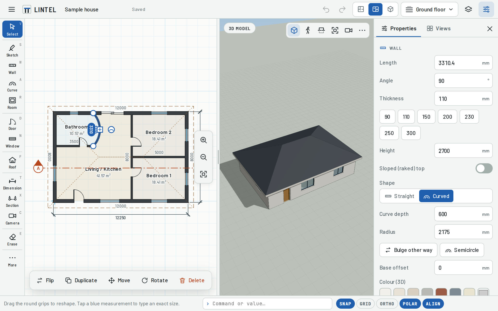

# Lintel Plan Studio

A floor-plan and 3D modelling app built for a Samsung Galaxy Tab S7+ (or any tablet, laptop or desktop). You sketch a room with the S Pen or a finger and it turns into proper walls. You can also draft precisely with a mouse and keyboard using CAD-style shortcuts. Then add doors, windows and a roof, and look at the result in 3D, in sections and elevations, or walk through it.

It runs in the browser, works offline once loaded, and installs to the home screen like an app. There is no server or account; your projects stay on the device unless you export them.



## What it does

**2D floor plan**
- **Sketch walls** freehand. Strokes are straightened and squared to 90°/45°, curves become curved walls, a closed loop becomes a room and a circle becomes a round room. Sketched walls snap onto walls you already drew.
- **Wall, curved wall and room tools** for precise drafting: tap point to point or drag, type exact lengths (`3600`, `3.6m`, `11'6"`, `3600<45`, `@1200,0`), draw along the centre line or along a face.
- Clean **wall joins** (mitred corners, T-junctions, three-way joins) and automatic **rooms** with names, colours and net floor areas.
- **Edit walls**: drag end points (joined walls follow), move a wall sideways (corners stay square), bend it into a curve, or type the length, angle, thickness or height. Switch between straight and curved, and give a wall a sloped (raked) top.
- **Doors**: single, double, sliding, pocket, bi-fold and garage. **Windows**: casement, sliding, fixed, awning and double-hung. Plain openings too. Tap the blue measurements to place them exactly.
- **Roofs**: hip, gable, shed or flat, with pitch (degrees or `6:12`), overhang and thickness. They work on L, T, U and curved footprints. **Auto roof** covers the building in one tap, and you can tap a roof edge to switch it between sloped and gable.
- **Dimensions, measure, text, levels** (multi-storey, with the floor below shown faded), snapping, polar tracking, alignment guides, ortho, grid.
- **Move, copy, rotate, mirror, offset, split, erase** (swipe to erase several things), undo/redo, copy/paste.

**3D**
- Live 3D model with shadows: walls with real openings, door leaves, window frames and glass, floors and roofs.
- **Orbit** (one finger or left mouse), pan and zoom (two fingers or right mouse and wheel). Double-tap to focus on a point.
- **Walk through** at eye height with an on-screen joystick or W A S D.
- **Elevations** (north, east, south and west) and **sections**. Draw a section line on the plan and open it as a cut view. Cut walls are filled solid, as in a drawn section.
- **Level cut** slices the model at a chosen height so you can see the floor plan in 3D.
- **Saved viewpoints** and **cameras** placed on the plan, like Revit or SketchUp scenes.

**Files**
- Projects autosave on the device. Open, duplicate and delete them from Projects.
- Export a plan image (PNG), a CAD drawing (DXF for AutoCAD, Revit, SketchUp or LibreCAD), a vector drawing (SVG at 1:100), a 3D image (PNG), 3D models (GLB and OBJ) and the project file (JSON) for backup.
- **Copy project** (in Export) and **Paste project** (in Projects) move a plan between devices as text, with no file needed.

## Use it on the Galaxy Tab S7+

You need to host the files somewhere once. Any static web host works. Pick one:

1. **GitHub Pages**: in this repository's **Settings → Pages**, choose *Deploy from a branch*, then `main` and `/ (root)`. GitHub Pages needs a public repository or a paid GitHub plan.
2. **Netlify Drop** (free, no account needed to try it): download this repository as a ZIP, unzip it, and drag the folder onto <https://app.netlify.com/drop>.
3. **Single file**: download [`dist/lintel.html`](dist/lintel.html) to the tablet and open it in Chrome or Samsung Internet. Everything is inside that one file. Offline install and file export behave best when the app is served from a web address, so options 1 or 2 are preferred.

Then on the tablet:

- **Chrome**: open the address, tap **⋮ → Add to home screen → Install**.
- **Samsung Internet**: open the address, tap **≡ → Add page to → Home screen**.

The app then opens full screen from its own icon and keeps working without internet.

### Tips for the S Pen, touch and mouse

- In **Settings**, turn on **Pen draws, fingers only pan and zoom** so your palm never draws.
- Two fingers always pinch-zoom and pan, in both 2D and 3D. With the Select tool, one finger dragging on empty space pans.
- **Offset cursor above finger** shows a crosshair just above your fingertip so you can see exactly where a wall starts.
- Mouse: the wheel zooms to the cursor, the middle button or Space+drag pans, and right-click finishes the current command.
- With a keyboard, start typing a number while drawing to enter an exact length.

## Keyboard shortcuts and command line

Single keys switch tools, much like SketchUp. Press **Enter** or **/** and type an AutoCAD or Revit style command (`L`, `REC`, `WA`, `DR`, `WN`, `CO`, `RO`, `MI`, `O`, `ZE` …) for the command line. **Esc** cancels, **Enter** finishes, and **F1** or **?** shows the full list in the app.

| Tool | Key | | Tool | Key |
|---|---|---|---|---|
| Select | `V` / `Space` | | Erase | `E` |
| Sketch walls | `S` | | Move | `M` |
| Wall | `W` | | Copy | `Shift+C` |
| Curved wall | `A` | | Rotate | `Q` |
| Room (rectangle) | `R` | | Mirror | `Shift+M` |
| Door | `D` | | Offset | `O` |
| Window | `N` | | Split wall | `Shift+S` |
| Roof / Auto roof | `F` / `Shift+F` | | Pan | `H` |
| Dimension / Measure | `T` / `Shift+T` | | Zoom to fit | `Z` |
| Section | `X` | | Zoom in / out | `+` / `-` |
| Camera | `C` | | Save 3D viewpoint | `Shift+V` |

| View and edit | Key |
|---|---|
| 2D plan / 3D / split / walk | `1` / `2` / `3` / `4`, or `Tab` to cycle |
| Undo / redo | `Ctrl+Z` / `Ctrl+Y` |
| Delete, select all, duplicate | `Delete`, `Ctrl+A`, `Ctrl+D` |
| Copy / cut / paste | `Ctrl+C` / `Ctrl+X` / `Ctrl+V` |
| Flip wall, door or section | `Shift+X` |
| Nudge selection | arrow keys (`Shift` for bigger steps) |
| Object snap, grid, ortho, grid snap, polar, alignment | `F3`, `G`/`F7`, `F8` (or hold `Shift`), `F9`, `F10`, `F11` |
| Level up / down | `Page Up` / `Page Down` |
| Projects, save, export, settings | `Ctrl+O`, `Ctrl+S`, `Ctrl+E`, `Ctrl+,` |
| Walk mode | `W A S D` or arrows, `Q`/`E` down/up, `Shift` to run |

While drawing a wall you can type `3600` (length along the cursor direction), `3600<90` (length and angle), `@1200,300` (relative x,y) and press Enter. `C` closes the room and `Backspace` removes the last segment. For a curved wall, type the curve depth (`600`) or a radius (`r2500`).

## Development

No build step is needed to run it: `index.html` loads plain ES modules.

```sh
npm install        # dev tools: esbuild and three (only for rebuilding vendor files)
npm start          # serve at http://localhost:8080
npm test           # geometry, roof, sketch and model tests (node --test)
npm run lint
npm run build      # regenerate sw.js (offline cache list) and dist/lintel.html
```

After changing app files, run `npm run build` so the offline cache picks up the new version.

```
index.html, css/, fonts/, icons/   page, styles, self-hosted fonts, app icons
js/core/     document model, undo/redo, edit operations, storage, units, sample house
js/geom/     wall paths and joins, room detection, straight-skeleton roofs, sketch recognition
js/plan/     2D canvas renderer, snapping, hit testing and the drawing tools
js/three/    3D model builder, materials (section poché), camera controls, 3D view
js/ui/       toolbar, panels, dialogs, command line, icons
js/io/       PNG, SVG, DXF and JSON export
vendor/      three.js r186 bundle (MIT)
tests/       node tests
tools/       build script
```

## Third-party licences

- [three.js](https://threejs.org) r186: MIT, bundled in `vendor/`.
- Fonts [Barlow](https://github.com/jpt/barlow) and [JetBrains Mono](https://github.com/JetBrains/JetBrainsMono): SIL Open Font License 1.1 (see `fonts/OFL-*.txt`).
